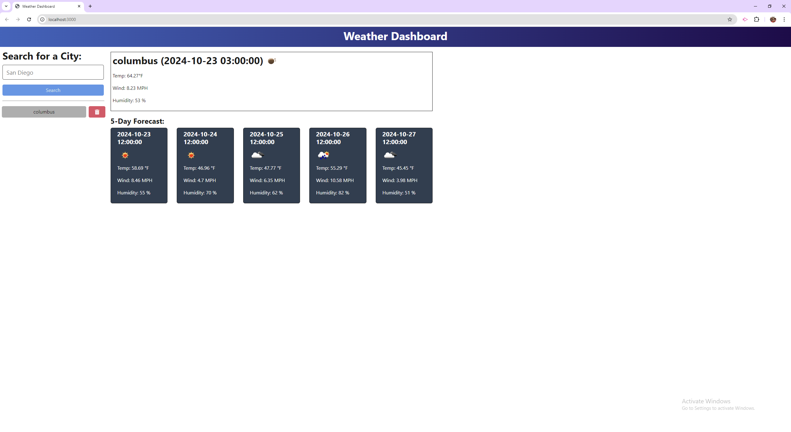

# 9-module-challenge

# Description
This project is a 5 day weather forecast that uses an API to get the current weather from a city and display the next 5 days. It also saves the previous cities searched on the site.
## Table of Contents
- Insallation](#installation)
- [Usage](#usage)
- [Contribution](#contribution)
- [Tests](#tests)
- [Questions](#questions)
## Usage
Here is a picture of the 5 day forecast website.
- 
- <https://nine-module-challenge.onrender.com/>
## Contribution
Nic Miller
Maverick Snider
## Tests

## License
This is licensed under <https://opensource.org/licenses/MIT>
## Questions
If you have questions you can reach me at my GitHub or email below.
- <https://github.com/NicMiller35>
- nicmiller13@gmail.com
